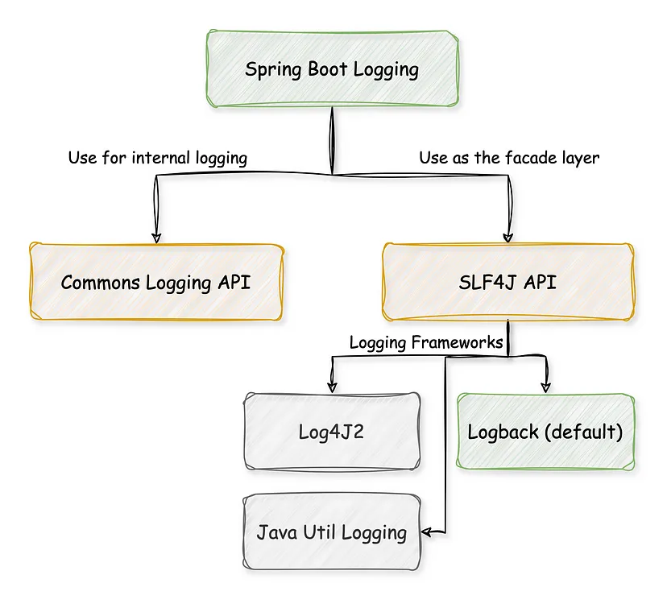
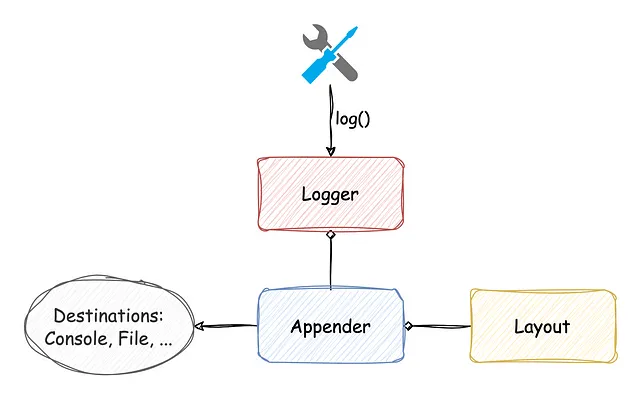
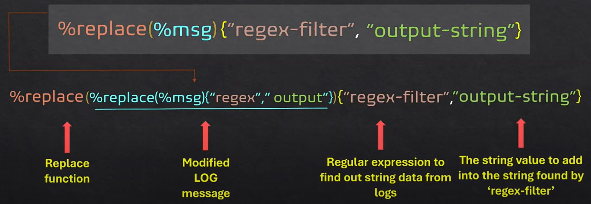

## [Logging](https://docs.spring.io/spring-boot/reference/features/logging.html)


Spring Boot uses [Commons Logging](https://commons.apache.org/logging) for all internal logging but leaves the underlying log implementation open.

Default configurations are provided for [Java Util Logging](https://docs.oracle.com/en/java/javase/17/docs/api/java.logging/java/util/logging/package-summary.html), [Log4j2](https://logging.apache.org/log4j/2.x/), and [Logback](https://logback.qos.ch/)

By default, if you use the starters, Logback is used for logging

## [Log Format](https://docs.spring.io/spring-boot/reference/features/logging.html#features.logging.log-format)
The default log output from Spring Boot resembles the following example:
````
2024-09-19T09:38:56.347Z  INFO 111370 --- [myapp] [           main] o.s.b.w.embedded.tomcat.TomcatWebServer  : Tomcat initialized with port 8080 (http)
````
- Date and Time: Millisecond precision and easily sortable.
- Log Level: ERROR, WARN, INFO, DEBUG, or TRACE.
- Process ID.
- A --- separator to distinguish the start of actual log messages.
- Application name: Enclosed in square brackets (logged by default only if spring.application.name is set)
- Thread name: Enclosed in square brackets (may be truncated for console output).
- Correlation ID: If tracing is enabled (not shown in the sample above)
- Logger name: This is usually the source class name (often abbreviated).
- The log message.

> Note: If you have a spring.application.name property but don’t want it logged you can set logging.include-application-name to false.

## [Console Output](https://docs.spring.io/spring-boot/reference/features/logging.html#features.logging.console-output)
By default, `ERROR`-level, `WARN`-level, and `INFO`-level messages are logged. You can also enable a “debug” mode by starting your application with a --debug flag.
````
$ java -jar myapp.jar --debug
````

## [File Output](https://docs.spring.io/spring-boot/reference/features/logging.html#features.logging.file-output)
````properties
# If both properties are set, logging.file.path is ignored and only logging.file.name is used.
logging.file.name=myapp.log
logging.file.path=C://log
````

## [File Rotation](https://docs.spring.io/spring-boot/reference/features/logging.html#features.logging.file-rotation)
If you are using the `Logback`, it is possible to fine-tune log rotation settings using your `application.properties` file.

For all other logging system, you will need to configure rotation settings directly yourself (for example, if you use Log4j2 then you could add a `log4j2.xml` or `log4j2-spring.xml` file).

|  Name | Description                                                            
|-------|------------------------------------------------------------------------|
| logging.logback.rollingpolicy.file-name-pattern    | The filename pattern used to create log archives.                                                                       |
| logging.logback.rollingpolicy.clean-history-on-start    | If log archive cleanup should occur when the application starts.                                                                       |
| logging.logback.rollingpolicy.max-file-size    | The maximum size of log file before it is archived.                    |
| logging.logback.rollingpolicy.total-size-cap    | The maximum amount of size log archives can take before being deleted. |
| logging.logback.rollingpolicy.max-history    | The maximum number of archive log files to keep (defaults to 7).       |

````properties
logging.logback.rollingpolicy.file-name-pattern=myapp.%d{yyyy-MM-dd}.%i.gz.log
logging.logback.rollingpolicy.max-file-size=10MB  # Daily log rotation (adjust if needed)
logging.logback.rollingpolicy.total-size-cap=1GB  # Total log size limit
logging.logback.rollingpolicy.max-history=7       # Keep logs for 7 days
logging.logback.rollingpolicy.clean-history-on-start=true  # Clean up old logs on startup
````

## Customizing Log Format and Patterns
````properties
logging.pattern.console=%d{yyyy-MM-dd HH:mm:ss.SSS} [%thread/%X{userId}] %-7level %logger{20} - %msg [%file:%line]%n
````

## Handling Log File Permissions and Access Control
Ensure that your log files are secure by setting appropriate permissions. For example:
````properties
# Set the owner to the application user and group
chown appuser:appgroup /var/log/app.log

# Set permissions to allow the owner to read/write, group to read, and no access for others
chmod 640 /var/log/app.log
````

or using logback-spring.xml
````xml
<appender name="FILE" class="ch.qos.logback.core.rolling.RollingFileAppender">
    <file>/var/log/app.log</file>
    <rollingPolicy class="ch.qos.logback.core.rolling.TimeBasedRollingPolicy">
        <fileNamePattern>/var/log/app.%d{yyyy-MM-dd}.log</fileNamePattern>
        <maxHistory>30</maxHistory>
    </rollingPolicy>
    <encoder>
        <pattern>%d{yyyy-MM-dd HH:mm:ss} - %msg%n</pattern>
    </encoder>
    <prudent>false</prudent>
    <fileNamePatternPermissions>rw-r-----</fileNamePatternPermissions>
</appender>

````


## [Log Levels](https://docs.spring.io/spring-boot/reference/features/logging.html#features.logging.log-levels) (FATAL < ERROR < WARN < INFO < DEBUG < TRACE)
All the supported logging systems can have the logger levels set in the Spring `Environment` (for example, in `application.properties`) by using `logging.level.<logger-name>=<level>` where `level` is one of TRACE, DEBUG, INFO, WARN, ERROR, FATAL, or OFF. The `root` logger can be configured by using `logging.level.root`.
````properties
-Dlogging.level.root=warn
-Dlogging.level.org.springframework.web=debug
logging.level.org.hibernate=error
````

or
````properties
mvn spring-boot:run 
  -Dspring-boot.run.arguments=--logging.level.org.springframework=TRACE,--logging.level.com.baeldung=TRACE
````

## log4j logging hierarchy order:

|       | Telemetry | Library | Collector | INFO | DEBUG | TRACE | ALL
|-------|-----------|---------|-----------|------|-------|-------|----
| OFF   |           |         |           |  |       |  |
| FATAL | X         |         |           |  |       |  |
| ERROR | X         | X       |           |  |       |  |
| WARN  | X         | X       | X         |  |       |  |
| INFO  | X         | X       | X         | X |       |  |
| DEBUG | X         | X       | X         | X | X     |  |
| TRACE | X         | X       | X         | X | X     | X |
| ALL   | X         | X       | X         | X | X     | X | X


## [Logback Extensions](https://docs.spring.io/spring-boot/reference/features/logging.html#features.logging.logback-extensions)
Spring Boot includes a number of extensions to Logback that can help with advanced configuration. You can use these extensions in your `logback-spring.xml` configuration file.
````xml
<springProfile name="staging">
	<!-- configuration to be enabled when the "staging" profile is active -->
</springProfile>

<springProfile name="dev | staging">
	<!-- configuration to be enabled when the "dev" or "staging" profiles are active -->
</springProfile>

<springProfile name="!production">
	<!-- configuration to be enabled when the "production" profile is not active -->
</springProfile>
````

Let’s write a simple logback-spring.xml:
````xml
<?xml version="1.0" encoding="UTF-8"?>
<configuration>

    <property name="LOGS" value="./logs" />

    <appender name="Console"
        class="ch.qos.logback.core.ConsoleAppender">
        <layout class="ch.qos.logback.classic.PatternLayout">
            <Pattern>
                %black(%d{ISO8601}) %highlight(%-5level) [%blue(%t)] %yellow(%C{1}): %msg%n%throwable
            </Pattern>
        </layout>
    </appender>

    <appender name="RollingFile"
        class="ch.qos.logback.core.rolling.RollingFileAppender">
        <file>${LOGS}/spring-boot-logger.log</file>
        <encoder
            class="ch.qos.logback.classic.encoder.PatternLayoutEncoder">
            <Pattern>%d %p %C{1} [%t] %m%n</Pattern>
        </encoder>

        <rollingPolicy
            class="ch.qos.logback.core.rolling.TimeBasedRollingPolicy">
            <!-- rollover daily and when the file reaches 10 MegaBytes -->
            <fileNamePattern>${LOGS}/archived/spring-boot-logger-%d{yyyy-MM-dd}.%i.log
            </fileNamePattern>
            <timeBasedFileNamingAndTriggeringPolicy
                class="ch.qos.logback.core.rolling.SizeAndTimeBasedFNATP">
                <maxFileSize>10MB</maxFileSize>
            </timeBasedFileNamingAndTriggeringPolicy>
        </rollingPolicy>
    </appender>
    
    <!-- LOG everything at INFO level -->
    <root level="info">
        <appender-ref ref="RollingFile" />
        <appender-ref ref="Console" />
    </root>

    <!-- LOG "com.baeldung*" at TRACE level -->
    <logger name="com.baeldung" level="trace" additivity="false">
        <appender-ref ref="RollingFile" />
        <appender-ref ref="Console" />
    </logger>

</configuration>

````

## Log4j2 Configuration Logging
````xml
<dependency>
    <groupId>org.springframework.boot</groupId>
    <artifactId>spring-boot-starter-web</artifactId>
    <exclusions>
        <exclusion>
            <groupId>org.springframework.boot</groupId>
            <artifactId>spring-boot-starter-logging</artifactId>
        </exclusion>
    </exclusions>
</dependency>

<dependency>
    <groupId>org.springframework.boot</groupId>
    <artifactId>spring-boot-starter-log4j2</artifactId>
</dependency>

````

## 7. Logging With Lombok
### 7.1. @Slf4j and @CommonsLog
````java
@RestController
@Slf4j
public class LombokLoggingController {
 
    @RequestMapping("/lombok")
    public String index() {
        log.trace("A TRACE Message");
        log.debug("A DEBUG Message");
        log.info("An INFO Message");
        log.warn("A WARN Message");
        log.error("An ERROR Message");
 
        return "Howdy! Check out the Logs to see the output...";
    }
}
````
### 7.2. @Log4j2
````java
@RestController
@Log4j2
public class LombokLoggingController {

    @RequestMapping("/lombok")
    public String index() {
        log.trace("A TRACE Message");
        log.debug("A DEBUG Message");
        log.info("An INFO Message");
        log.warn("A WARN Message");
        log.error("An ERROR Message");

        return "Howdy! Check out the Logs to see the output...";
    }
}

````

## [What is a Logback Appender?](https://logback.qos.ch/manual/appenders.html)
The three main components in Logback architecture are: Logger, Appender, and Layout. In very simple terms:

Logback delegates the task of writing a logging event to components called appenders. Appenders must implement the `ch.qos.logback.core.Appender` interface.
> A `Logger` is an interface for creating log messages. An `Appender` sends log messages to a target, and a Logger can have several appenders. Finally, As it turns out, a `Layout` is responsible for formatting the log message before it is sent to the target.



````java
public interface Appender<E> extends LifeCycle, ContextAware, FilterAttachable { 
    public String getName();
    public void setName(String name);
    void doAppend(E event);
}
````


## [AppenderBase:](https://logback.qos.ch/manual/appenders.html#AppenderBase)

````java
public synchronized void doAppend(E eventObject) {
    // prevent re-entry.
    if (guard) {
        return;
    }

    try {
        guard = true;

        if (!this.started) {
            if (statusRepeatCount++ < ALLOWED_REPEATS) {
                addStatus(new WarnStatus(
                        "Attempted to append to non started appender [" + name + "].",this));
            }
            return;
        }

        if (getFilterChainDecision(eventObject) == FilterReply.DENY) {
            return;
        }

        // ok, we now invoke the derived class's implementation of append
        this.append(eventObject);

    } finally {
        guard = false;
    }
}
````
## [OutputStreamAppender](https://logback.qos.ch/manual/appenders.html#OutputStreamAppender)
`OutputStreamAppender` appends events to a `java.io.OutputStream`. This class provides basic services that other appenders build upon.

Users do not usually instantiate `OutputStreamAppender` objects directly, since in general the `java.io.OutputStream` type cannot be conveniently mapped to a string

The `OutputStreamAppender` is the super-class of three other appenders, namely `ConsoleAppender`, `FileAppender` which in turn is the super class of `RollingFileAppender`.


## [ConsoleAppender](https://logback.qos.ch/manual/appenders.html#ConsoleAppender)
````xml
<configuration>

  <appender name="STDOUT" class="ch.qos.logback.core.ConsoleAppender">
    <!-- encoders are assigned the type
         ch.qos.logback.classic.encoder.PatternLayoutEncoder by default -->
    <encoder>
      <pattern>%-4relative [%thread] %-5level %logger{35} -%kvp- %msg %n</pattern>
    </encoder>
  </appender>

  <root level="DEBUG">
    <appender-ref ref="STDOUT" />
  </root>
  </configuration>
````

## [FileAppender](https://logback.qos.ch/manual/appenders.html#FileAppender)
````xml
<configuration>

    <!-- Insert the current time formatted as "yyyyMMdd'T'HHmmss" under
         the key "bySecond" into the logger context. This value will be
         available to all subsequent configuration elements. -->
    <timestamp key="bySecond" datePattern="yyyyMMdd'T'HHmmss"/>
    
    <appender name="FILE" class="ch.qos.logback.core.FileAppender">
        <!-- use the previously created timestamp to create a uniquely named log file -->
        <file>testFile-${bySecond}.log</file>
        <append>true</append>
        <!-- set immediateFlush to false for much higher logging throughput -->
        <immediateFlush>true</immediateFlush>
        <!-- encoders are assigned the type
            ch.qos.logback.classic.encoder.PatternLayoutEncoder by default -->
        <encoder>
            <pattern>%-4relative [%thread] %-5level %logger{35} -%kvp- %msg%n</pattern>
        </encoder>
    </appender>

    <root level="DEBUG">
        <appender-ref ref="FILE" />
    </root>
</configuration>
````

## Logback TCP appender
````xml
<?xml version="1.0" encoding="UTF-8"?>
<configuration>
    <appender name="STASH" class="net.logstash.logback.appender.LogstashTcpSocketAppender">
        <destination>YOUR-IP:PORT</destination>
        <ringBufferSize>1024</ringBufferSize>
        <keepAliveDuration>5 minutes</keepAliveDuration>
        <!-- encoder is required -->
        <!-- <encoder class="net.logstash.logback.encoder.LogstashEncoder" /> -->
        <encoder class="net.logstash.logback.encoder.LogstashEncoder" >
            <customFields>{
                "app":"",
                "es_id":"",
                "es_ver":"0.02",
                "api": "",
                "env_name":"",
                "app_id":"",
                "category":"app"
                }
            </customFields>
        </encoder>

        <ssl>
            <trustStore>
                <location>file:/etc/esaas/keystore/esaas-keystore.jks</location>
                <password>****</password>
            </trustStore>
            <keyStore>
                <location>file:/etc/esaas/keystore/esaas-keystore.jks</location>
                <password>****</password>
            </keyStore>
        </ssl>

    </appender>

    <logger name="org.hibernate" level="TRACE">
        <appender-ref ref="STASH"/>
    </logger>

    <root level="INFO">
        <appender-ref ref="STDOUT"/>
        <appender-ref ref="STASH"/>
    </root>
</configuration>
````


## Other Appenders:
- [SMTPAppender](https://logback.qos.ch/manual/appenders.html#SMTPAppender)
- [DBAppender](https://logback.qos.ch/manual/appenders.html#DBAppender)
- [AsyncAppender](https://logback.qos.ch/manual/appenders.html#AsyncAppender): AsyncAppender buffers events in a `BlockingQueue`. A worker thread created by `AsyncAppender` takes events from the head of the queue, and dispatches them to the single appender attached to `AsyncAppender`.
-

## Creating a Custom Logback Appender
````java
public class MapAppender extends AppenderBase<ILoggingEvent> {
    private ConcurrentMap<String, ILoggingEvent> eventMap = new ConcurrentHashMap<>();
    private String prefix;
    
    @Override
    protected void append(ILoggingEvent event) {
        if (prefix == null || "".equals(prefix)) {
            addError("Prefix is not set for MapAppender.");
            return;
        }
        eventMap.put(prefix + System.currentTimeMillis(), event);
    }

    public Map<String, ILoggingEvent> getEventMap() {
        return eventMap;
    }
    public String getPrefix() { return prefix;}

    public void setPrefix(String prefix) { this.prefix = prefix;}
}
````
Next, to enable the MapAppender to start receiving logging events, let’s add it as an appender in our configuration file logback.xml:
````xml
<configuration debug="true">
    <appender name="map" class="com.baeldung.logback.MapAppender">
        <prefix>test</prefix>
    </appender>
    <root level="info">
        <appender-ref ref="map"/>
    </root>
</configuration>
````

## [Access to Spring ApplicationContext from a custom Logback appender](How to call a Spring Bean from a custom Logback appender class)
After a brief introduction about Logback and Spring Boot logging, let’s dive into the code and see what the root of the problem is. In my case, I have a custom Logback appender (NotificationAppender) that is supposed to send a notification (for example, email, push notification, or…) under certain circumstances (for example, the occurrence of a specific number of error logs or finding a specific text in the logs, or…).

To send that notification, the NotificationAppender needs to access a Spring bean called Notifier, but as we mentioned before, Logback is not managed by the Spring ApplicationContext, so it does not access ApplicationContext, and we can not inject the Notifier bean in our custom appender (NotificationAppender), it means this code will not work:

````java
public class NotificationAppender extends AppenderBase<ILoggingEvent> {
    @Autowired
    private  Notifier notifier;
    @Override
    protected void append(ILoggingEvent loggingEvent) {
        notifier.notify(loggingEvent.getFormattedMessage());
    }
}
````

I registered the NotificationAppender in the logback-spring.xml:
````xml
<configuration debug="true">
    <include resource="org/springframework/boot/logging/logback/defaults.xml"/>
    <include resource="org/springframework/boot/logging/logback/console-appender.xml" />
    <appender name="NOTIFY" class="com.saeed.springlogbackappender.NotificationAppender"/>
    <logger name="org.springframework.web" level="DEBUG"/>
    <root level="INFO">
        <appender-ref ref="CONSOLE" />
        <appender-ref ref="NOTIFY" />
    </root>
</configuration>
````
We will get errors like this because, as I mentioned, Logback does not access the ApplicationContext:
````
10:41:05,660 |-ERROR in com.saeed.springlogbackappender.NotificationAppender[NOTIFY] - Appender [NOTIFY] failed to append. java.lang.NullPointerException: Cannot invoke "com.saeed.springlogbackappender.Notifier.notify(String)" because "this.notifier" is null
 at java.lang.NullPointerException: Cannot invoke "com.saeed.springlogbackappender.Notifier.notify(String)" because "this.notifier" is null
````
Even if we change the appender class and make it a Spring bean by adding @Component on top of the class, The situation is getting worse.
````java
@Component
public class NotificationAppender extends AppenderBase<ILoggingEvent> {
    private  Notifier notifier;
    public NotificationAppender(Notifier notifier) {
        this.notifier = notifier;
    }
    @Override
    protected void append(ILoggingEvent loggingEvent) {
        notifier.notify(loggingEvent.getFormattedMessage());
    }
}
````
And we will get an error similar to this:
````properties
10:53:57,887 |-ERROR in ch.qos.logback.core.model.processor.AppenderModelHandler - Could not create an Appender of type [com.saeed.springlogbackappender.NotificationAppender]. ch.qos.logback.core.util.DynamicClassLoadingException: Failed to instantiate type com.saeed.springlogbackappender.NotificationAppender
Caused by: java.lang.NoSuchMethodException: com.saeed.springlogbackappender.NotificationAppender.<init>()
````

This is because Logback needs a default constructor to initialize the `NotificationAppender`. If we add the default constructor to the class, we will get the previous `NullPointerException` for the Notifier bean because now we have two instances of `NotificationAppender` in our application, one instantiated and managed by `Logback` and the other by `ApplicationContext`!


Now, we want to solve this problem by providing three solutions. I have created a spring boot project called spring-logback-appender in GitHub and created separate commits for each solution.

## 1- Spring Boot creates the bean and adds it as a Logback appender dynamically in @PostConstruct
In this approach, we define the NotificationAppender as a Spring bean, so we can inject every Spring bean into it without a problem. But As we saw in the problem statement before, how do we want to introduce this Spring bean as an appender to Logback? We will do it programmatically using the LoggerContext:
````java
@Component
public class NotificationAppender extends AppenderBase<ILoggingEvent> {
    private final Notifier notifier;
    public NotificationAppender(Notifier notifier) {
        this.notifier = notifier;
    }
    @Override
    protected void append(ILoggingEvent loggingEvent) {
        notifier.notify(loggingEvent.getFormattedMessage());
    }
    @PostConstruct
    public void init() {
        LoggerContext loggerContext = (LoggerContext) LoggerFactory.getILoggerFactory();
        Logger rootLogger = loggerContext.getLogger(Logger.ROOT_LOGGER_NAME);
        rootLogger.addAppender(this);
        setContext(context);
        start();
    }
}
````
This will work, and if we call the `/hello` API, we will see that the `Notifier` will notify using the appender.

For me, this approach has some drawbacks:
- It is less flexible because the appender is not configurable in the logback-spring.xml file.
- We will miss some logs at the early stage of the Spring boot start.

## 2- Logback creates the appender and then fills the bean dependency in the custom appender using the ApplicationContexAware
In this approach, to fix one important drawback of the first approach, we will register the Logback appender in a standard way by adding it to the logback-spring.xml file.
````xml
<configuration debug="true">
    <include resource="org/springframework/boot/logging/logback/defaults.xml"/>
    <include resource="org/springframework/boot/logging/logback/console-appender.xml" />
    <appender name="NOTIFY" class="com.saeed.springlogbackappender.NotificationAppender"/>
    <logger name="org.springframework.web" level="DEBUG"/>
    <root level="INFO">
        <appender-ref ref="CONSOLE" />
        <appender-ref ref="NOTIFY" />
    </root>
</configuration>
````

The other change that we need to make is to make the Notifier field static and `NotificationAppender` implement the ApplicationContextAware:
````java
@Component
public class NotificationAppender extends AppenderBase<ILoggingEvent> implements ApplicationContextAware {
    private static Notifier notifier;
    @Override
    protected void append(ILoggingEvent loggingEvent) {
        if (notifier != null)
            notifier.notify(loggingEvent.getFormattedMessage());
    }
    @Override
    public void setApplicationContext(ApplicationContext applicationContext) throws BeansException {
        notifier = applicationContext.getAutowireCapableBeanFactory().getBean(Notifier.class);
    }
}
````
This approach will result in a similar result to the first approach, but now the appender is configurable using a standard method in the Logback.

We still have some drawbacks to this approach:
- We need to check if the notifier is not null and make it static.
- Since the injected class is not present before the Spring ApplicationContext loads completely, we will miss some logs at an early stage of the application start.

## 3- As mentioned above, you might be interested in not losing the events logged during the Spring Boot startup
In the third and last approach, we will concentrate on fixing the problem of missing logs in the early stages of the application start. For this approach, I was inspired by [this question](https://stackoverflow.com/questions/42859896/dependency-injection-into-logback-appenders-with-spring-boot) on StackOverflow to mix both previous approaches and create a new AppenderDelegator class.

In this approach, we will define two appenders:
- `AppenderDelegator`: Register as an appender in the Logback config file (logback-spring.xml). This appender is our main appender, acts as a `delegator`, and has a buffer to store log events for when the actual logger is not yet ready to log.

````java
public class AppenderDelegator<E> extends UnsynchronizedAppenderBase<E> {
    private final ArrayList<E> logBuffer = new ArrayList<>(1024);
    private Appender<E> delegate;
    @Override
    protected void append(E event) {
        synchronized (logBuffer) {
            if (delegate != null) {
                delegate.doAppend(event);
            } else {
                logBuffer.add(event);
            }
        }
    }
    public void setDelegateAndReplayBuffer(Appender<E> delegate) {
        synchronized (logBuffer) {
            this.delegate = delegate;
            for (E event : this.logBuffer) {
                delegate.doAppend(event);
            }
            this.logBuffer.clear();
        }
    }
}
````
- NotificationAppender: This is our actual appender, which is configured programmatically and uses the Spring SmartLifecycle to have more control over its lifecycle. We will connect this appender to the delegator one during the component start lifecycle:

````java
@Component
public class NotificationAppender extends AppenderBase<ILoggingEvent> implements SmartLifecycle {
    private final Notifier notifier;
    public NotificationAppender(Notifier notifier) {
        this.notifier = notifier;
    }
    @Override
    protected void append(ILoggingEvent loggingEvent) {
        notifier.notify(loggingEvent.getFormattedMessage());
    }
    @Override
    public boolean isRunning() {
        return isStarted();
    }
    @Override
    public void start() {
        super.start();
        LoggerContext loggerContext = (LoggerContext) LoggerFactory.getILoggerFactory();
        Logger rootLogger = loggerContext.getLogger(Logger.ROOT_LOGGER_NAME);
        AppenderDelegator<ILoggingEvent> delegate = (AppenderDelegator<ILoggingEvent>) rootLogger.getAppender("DELEGATOR");
        delegate.setDelegateAndReplayBuffer(this);
    }
}
````


## [Correlating Log and Trace using Digma](https://digma.ai/calling-a-spring-bean-from-custom-logback-appender-class/)

## Encoders
Encoders are responsible for transforming an incoming event into a byte array and writing out the resulting byte-array onto the appropriate `OutputStream.`

In our configuration file, a “CONSOLE_JSON” appender is set with an encoder of type `LoggingEventCompositeJsonEncoder`. When this encoder is used, it’s mandatory to define the providers we want to use.
````xml
<appender name="CONSOLE-JSON" class="ch.qos.logback.core.ConsoleAppender">
  <encoder class="net.logstash.logback.encoder.LoggingEventCompositeJsonEncoder">
    <providers>
        <arguments>
            <fieldName>context</fieldName>
        </arguments>
        <pattern>
          <pattern>
              {
              "date": "%date{ISO8601,GMT+2}",
              "priority": "%level",
              "pid": "${PID:- }",
              "thread": "%t",
              "logger": "%logger",
              "message": "%.-10000msg",
              "stacktrace": "%.-10000throwable",
              "team": "%property{team}"
              }
          </pattern>
        </pattern>
        <mdc>net.logstash.logback.composite.loggingevent.MdcJsonProvider</mdc>
    </providers>
  </encoder>
</appender>
````
For this configuration, we use:
- Arguments provider → Outputs fields from the event arguments array that are defined by [Structured Arguments](https://github.com/logfellow/logstash-logback-encoder#event-specific-custom-fields). Adding the `<fieldName>context</fieldName>` element will add the field “context” with its value into the JSON output
- pattern provider → Outputs fields from a configured JSON Object string, substituting patterns supported by logback’s `PatternLayout`. Refer to official documentation about [PatternLayout](https://logback.qos.ch/manual/layouts.html#ClassicPatternLayout) and [Pattern JSON Provider](https://github.com/logfellow/logstash-logback-encoder#pattern-json-provider).
- mdc provider → defined by the class “MDCJsonProvider”. Outputs entries from the [Mapped Diagnostic Context (MDC).](https://logback.qos.ch/manual/mdc.html)


## [Mask, Hide & Replace Sensitive Data In Spring Boot Logs](https://youtu.be/3YK6UZq_51E?si=5ELBDqOIIUeWemWf)



## [Writing your own custom Layout](https://logback.qos.ch/manual/layouts.html#writingYourOwnLayout)
````java
public class MySampleLayout extends LayoutBase<ILoggingEvent> {

  public String doLayout(ILoggingEvent event) {
    StringBuffer sbuf = new StringBuffer(128);
    sbuf.append(event.getTimeStamp() - event.getLoggingContextVO.getBirthTime());
    sbuf.append(" ");
    sbuf.append(event.getLevel());
    sbuf.append(" [");
    sbuf.append(event.getThreadName());
    sbuf.append("] ");
    sbuf.append(event.getLoggerName();
    sbuf.append(" - ");
    sbuf.append(event.getFormattedMessage());
    sbuf.append(CoreConstants.LINE_SEP);
    return sbuf.toString();
  }
}
````
Note that `MySampleLayout` extends `LayoutBase`. This class manages state common to all layout instances, such as whether the layout is started or stopped, header, footer and content type data.

````xml
<configuration>

  <appender name="STDOUT" class="ch.qos.logback.core.ConsoleAppender">
    <encoder class="ch.qos.logback.core.encoder.LayoutWrappingEncoder">
      <layout class="chapters.layouts.MySampleLayout" />
    </encoder>
  </appender>

  <root level="DEBUG">
    <appender-ref ref="STDOUT" />
  </root>
</configuration>
````


# FAQ:
1. What is default logging in SpringBoot?
    - When using starters, Logback is used for logging by default.[logback](https://logback.qos.ch/)
2. Logback vs Log4J
    - [Reasons to prefer logback over log4j 1.x](https://logback.qos.ch/reasonsToSwitch.html)
        - <b>Faster implementation:</b> Based on our previous work on log4j 1.x, logback internals have been re-written to perform about ten times faster on certain critical execution paths. Not only are logback components faster, they have a smaller memory footprint as well.
        - [Filters](https://logback.qos.ch/reasonsToSwitch.html#filters): Logback comes with a wide array of filtering capabilities going much further than what log4j 1.x has to offer. For example, let's assume that you have a business-critical application deployed on a production server. Given the large volume of transactions processed, logging level is set to WARN so that only warnings and errors are logged. Now imagine that you are confronted with a bug that can be reproduced on the production system but remains elusive on the test platform due to unspecified differences between those two environments (production/testing).
          <br/> <br/>With log4j 1.x, your only choice is to lower the logging level to DEBUG on the production system in an attempt to identify the problem. Unfortunately, this will generate large volume of logging data, making analysis difficult. More importantly, extensive logging can impact the performance of your application on the production system.
          <br/><br/>With logback, you have the option of keeping logging at the WARN level for all users except for the one user, say Alice, who is responsible for identifying the problem. When Alice is logged on, she will be logging at level DEBUG while other users can continue to log at the WARN level. This feat can be accomplished by adding 4 lines of XML to your configuration file. Search for MDCFilter in the relevant section of the manual.

##  Conditional Logging Based on Profiles
We can configure Logback to apply different logging configurations based on the active Spring profile using the `<springProfile>` tag. This allows you to define separate logging behaviors for development, testing, and production environments.
````xml
<configuration>

    <!-- Default profile: logs INFO level and higher to the console -->
    <springProfile name="default">
        <appender name="CONSOLE" class="ch.qos.logback.core.ConsoleAppender">
            <encoder>
                <pattern>%d{yyyy-MM-dd HH:mm:ss} %-5level %logger{36} - %msg%n</pattern>
            </encoder>
        </appender>

        <root level="INFO">
            <appender-ref ref="CONSOLE" />
        </root>
    </springProfile>

    <!-- Development profile: logs DEBUG level and higher to the console -->
    <springProfile name="dev">
        <appender name="CONSOLE" class="ch.qos.logback.core.ConsoleAppender">
            <encoder>
                <pattern>%d{yyyy-MM-dd HH:mm:ss} %-5level %logger{36} - %msg%n</pattern>
            </encoder>
        </appender>

        <root level="DEBUG">
            <appender-ref ref="CONSOLE" />
        </root>
    </springProfile>

    <!-- Production profile: logs WARN level and higher to a file -->
    <springProfile name="prod">
        <appender name="FILE" class="ch.qos.logback.core.rolling.RollingFileAppender">
            <file>logs/app.log</file>
            <rollingPolicy class="ch.qos.logback.core.rolling.TimeBasedRollingPolicy">
                <fileNamePattern>logs/app.%d{yyyy-MM-dd}.log</fileNamePattern>
                <maxHistory>30</maxHistory>
            </rollingPolicy>
            <encoder>
                <pattern>%d{yyyy-MM-dd HH:mm:ss} %-5level %logger{36} - %msg%n</pattern>
            </encoder>
        </appender>

        <root level="WARN">
            <appender-ref ref="FILE" />
        </root>
    </springProfile>

</configuration>

````

## Utilizing Logback's Built-In Filtering Mechanisms
Logback allows you to apply filters to loggers or appenders to fine-tune what gets logged. For instance, you might want to exclude `DEBUG` level logs from being written to a file while still logging `INFO` and higher levels.
````xml
<configuration>

    <!-- File Appender with a Level Filter -->
    <appender name="FILTERED_FILE" class="ch.qos.logback.core.rolling.RollingFileAppender">
        <file>logs/filtered-app.log</file>
        <rollingPolicy class="ch.qos.logback.core.rolling.TimeBasedRollingPolicy">
            <fileNamePattern>logs/filtered-app.%d{yyyy-MM-dd}.log</fileNamePattern>
            <maxHistory>30</maxHistory>
        </rollingPolicy>
        <encoder>
            <pattern>%d{yyyy-MM-dd HH:mm:ss} %-5level %logger{36} - %msg%n</pattern>
        </encoder>

        <!-- Exclude DEBUG logs from being written to this file -->
        <filter class="ch.qos.logback.classic.filter.LevelFilter">
            <level>DEBUG</level>
            <onMatch>DENY</onMatch>
            <onMismatch>ACCEPT</onMismatch>
        </filter>
    </appender>

    <root level="DEBUG">
        <appender-ref ref="FILTERED_FILE" />
    </root>
</configuration>
````

## Implementing Multiple Log Files
For complex applications, you might want separate log files for different components: We will create two new classes MyController, and MyServices. Additionally, we will also modify the main to call these methods. We can implement separate logging mechanisms for each of these classes. The below configuration ensures that separate log files are created and different log levels are set for both.
````java
// Controller classs
package com.example.demo;

import org.slf4j.Logger;
import org.slf4j.LoggerFactory;
import org.springframework.stereotype.Controller;

@Controller
public class MyController {

    private static final Logger logger = LoggerFactory.getLogger(MyController.class);

    public String controllerLog() {
        logger.debug("This is a DEBUG message from the controller.");
        logger.info("This is an INFO message from the controller.");
        return "Check the controller.log for logs.";
    }
}
// Service Class
package com.example.demo;

import org.slf4j.Logger;
import org.slf4j.LoggerFactory;
import org.springframework.stereotype.Service;

@Service
public class MyService {

    private static final Logger logger = LoggerFactory.getLogger(MyService.class);

    public void serviceLog() {
        logger.info("This is an INFO message from the service.");
        logger.error("This is an ERROR message from the service.");
    }
}
// LoggingApplication (main)
package com.example.demo;

import org.springframework.boot.CommandLineRunner;
import org.springframework.boot.SpringApplication;
import org.springframework.boot.autoconfigure.SpringBootApplication;
import org.springframework.context.annotation.Bean;

@SpringBootApplication
public class LoggingApplication {

    public static void main(String[] args) {
        SpringApplication.run(LoggingApplication.class, args);
    }

    @Bean
    CommandLineRunner run(MyService myService, MyController myController) {
        return args -> {
            myService.serviceLog();
            myController.controllerLog();  // Log from the controller as well
        };
    }
}
````
````xml
<configuration>

    <!-- Define properties for log file names -->
    <property name="CONTROLLER_LOG" value="controller.log" />
    <property name="SERVICE_LOG" value="service.log" />

    <!-- Define the appender for controller logs -->
    <appender name="CONTROLLER_FILE" class="ch.qos.logback.core.rolling.RollingFileAppender">
        <file>${CONTROLLER_LOG}</file>
        <encoder>
            <pattern>%d{yyyy-MM-dd HH:mm:ss.SSS} [%thread] %-5level %logger{36} - %msg%n</pattern>
        </encoder>
        <rollingPolicy class="ch.qos.logback.core.rolling.TimeBasedRollingPolicy">
            <fileNamePattern>${CONTROLLER_LOG}.%d{yyyy-MM-dd}.gz</fileNamePattern>
            <maxFileSize>10MB</maxFileSize>
            <maxHistory>7</maxHistory>
            <totalSizeCap>1GB</totalSizeCap>
        </rollingPolicy>
    </appender>

    <!-- Define the appender for service logs -->
    <appender name="SERVICE_FILE" class="ch.qos.logback.core.rolling.RollingFileAppender">
        <file>${SERVICE_LOG}</file>
        <encoder>
            <pattern>%d{yyyy-MM-dd HH:mm:ss.SSS} [%thread] %-5level %logger{36} - %msg%n</pattern>
        </encoder>
        <rollingPolicy class="ch.qos.logback.core.rolling.TimeBasedRollingPolicy">
            <fileNamePattern>${SERVICE_LOG}.%d{yyyy-MM-dd}.gz</fileNamePattern>
            <maxFileSize>10MB</maxFileSize>
            <maxHistory>7</maxHistory>
            <totalSizeCap>1GB</totalSizeCap>
        </rollingPolicy>
    </appender>

    <!-- Define the controller logger -->
    <logger name="com.myapp.controllers" level="DEBUG" additivity="false">
        <appender-ref ref="CONTROLLER_FILE" />
    </logger>

    <!-- Define the service logger -->
    <logger name="com.myapp.services" level="INFO" additivity="false">
        <appender-ref ref="SERVICE_FILE" />
    </logger>

    <!-- Define the root logger -->
    <root level="ERROR">
        <appender-ref ref="CONTROLLER_FILE" />
        <appender-ref ref="SERVICE_FILE" />
    </root>

</configuration>
````

## Setting Up Asynchronous Logging
Asynchronous logging improves performance by offloading log processing to a separate thread:
````xml
<appender name="ASYNC_FILE" class="ch.qos.logback.classic.AsyncAppender">
    <appender-ref ref="CONTROLLER_FILE" />
    <appender-ref ref="SERVICE_FILE" />
</appender>
````


## [Log4J vs Log4J2 vs Logback](https://logback.qos.ch/performance.html#:~:text=By%20default%2C%20log4j%201.2%20uses,ring%20buffer%20should%20favor%20log4j2.)

<table>
  <tr>
    <td></td>
    <td>Log4J2</td>
    <td>Logback</td>
  </tr>
  <tr>
    <td>Buffer</td>
    <td>
        By default:
        <li>log4j 1.2 uses a <b>circular buffer size of 128</b> </li>
        <li>log4j2 uses a <b>ring buffer size of 262'144 </b></li>
    </td>
    <td>
        <li>logback is set to a buffer size of 256.</li>
        <b>In principle, the much larger ring buffer should favor log4j2.</b>
    </td>
  </tr>
  <tr>
    <td rowspan="2">Performance</td>
    <td>When comparing the performance of apache log4j synchronous logger to logback, then log4j is 25 % much faster.</td>
    <td>When the logback is compared to logback synchronous logger, then the logback was worse in performance but only with the logback versions less than 1.2.1. Therefore the newer versions are of logback is a successor to log4j.</td>
  </tr>
  <tr>
    <td>Log4j’s synchronous appender is the fastest among any other logging frameworks, but log4j’s asynchronous appender cannot resolve bugs in multithreading logging.</td>
    <td>Logback asynchronous appender is also not recommended for multithreading logging as this also cannot debug the bugs, and logback synchronous appenders performance is less when compared to log4j.</td>
  </tr>
  <tr>
    <td><a href="https://logback.qos.ch/performance.html#:~:text=By%20default%2C%20log4j%201.2%20uses,ring%20buffer%20should%20favor%20log4j2.">Benchmark</a></td>
    <td></td>
    <td>
        <li>logback version 1.3-alpha10 performs about 3 times faster than log4j and about 1.6 times faster than log4j2 in case of synchronous logging. </li>
        <li> For asynchronous logging, logback 1.3 performs 2.5 faster than log4j and 2.3 times faster than log4j2.</li>
    </td>
  </tr>
  <tr>
    <td>Configuration</td>
    <td>
        log4j.appender.file=org.apache.log4j.FileAppender 
        <br/>
        log4j.appender.file.File=app.log 
        <br/>
        log4j.appender.file.layout=org.apache.log4j.PatternLayout
        <br/>
        log4j.appender.file.layout.ConversionPattern=%d{HH:mm:ss,SSS} %-5p [%c] - %m%n
        <br/>
        <br/>
        log4j.rootLogger=info, file
        <br/>
        # basic log level for all messages
        <br/>
        log4j.logger.org.hibernate=info
        <br/>
        <br/>
        # SQL statements and parameters
        <br/>
        log4j.logger.org.hibernate.SQL=debug
        <br/>
        log4j.logger.org.hibernate.type.descriptor.sql=trace
    </td>
    <td>
<pre>
&lt;configuration&gt;
    &lt;appender name="FILE" class="ch.qos.logback.core.FileAppender"&gt;
        &lt;file&gt;app.log&lt;/file&gt
        &lt;encoder&gt;
            &lt;pattern&gt; %d{HH:mm:ss,SSS} %-5p [%c] - %m%n &lt;/pattern&gt;
        &lt;/encoder&gt
    &lt;/appender&gt
    &lt;logger name="org.hibernate.SQL" level="DEBUG" /&gt;
    &lt;logger name="org.hibernate.type.descriptor.sql" level="TRACE" /&gt;
    &lt;root level="info" &gt;
        &lt;appender-ref="FILE" /&gt;
    &lt;/root&gt;
&lt;/configuration&gt;
 
</pre>
    </td>
  </tr>
  <tr>
    <td>Conclusion</td>
    <td colspan="2">
        <li>Logback was written by the same developer who implemented Log4j with the goal to become its successor.  It follows the same concepts as Log4j but was rewritten to improve the performance, to support SLF4J natively,</li>
        <li>It concludes that there is no much difference in these logging frameworks based on Java applications. The log4j is less considered than logback only when there were no higher logback versions, but now logback is considered faster than log4j. Therefore we cannot recommend any java logging utility based on the performance as buffered handler implementations impact it. So there is no much difference that can be figured in log4j and logback.</li>
    </td>
  </tr>
 </table>

The above [benchmark](https://logback.qos.ch/performance.html#:~:text=By%20default%2C%20log4j%201.2%20uses,ring%20buffer%20should%20favor%20log4j2.) results show that throughput in synchronous logging is actually higher than that of asynchronous logging.


# References:
- Latency and Throughput With Logback: https://tersesystems.com/blog/2022/10/16/latency-and-throughput-with-logback/
- Github Repository : https://github.com/FacuRamallo/Logging-Agregation-System-ELKK
- Further reading: https://medium.com/@facuramallo8/logging-aggregation-system-d94f60f92dd0
- LogBack Appenders: https://logback.qos.ch/manual/appenders.html
- https://docs.spring.io/spring-boot/docs/2.1.8.RELEASE/reference/html/howto-logging.html
- https://github.com/logfellow/logstash-logback-encoder#encoders--layouts
- https://stegard.net/2021/02/spring-boot-http-access-logging-in-three-steps/
- https://github.com/spring-projects/spring-boot/blob/v3.2.0/spring-boot-project/spring-boot/src/main/resources/org/springframework/boot/logging/logback/defaults.xml
- https://sematext.com/glossary/structured-logging/#:~:text=Structured%20logging%20is%20the%20practice,application%20or%20an%20interested%20individual.
- https://springframework.guru/using-logback-spring-boot/
- https://logback.qos.ch/manual/configuration.html
- https://www.baeldung.com/spring-boot-embedded-tomcat-logs
- https://github.com/akkinoc/logback-access-spring-boot-starter
- https://cassiomolin.com/programming/log-aggregation-with-spring-boot-elastic-stack-and-docker/
