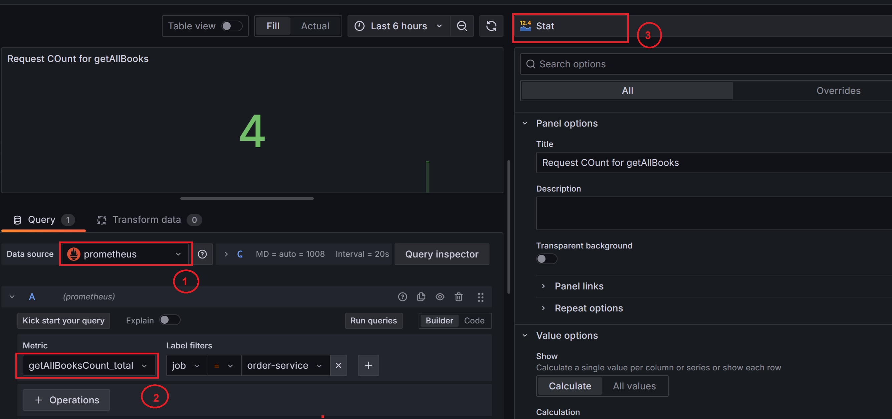
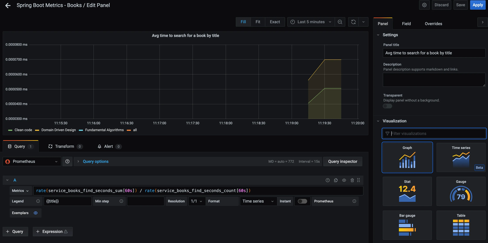

## 1. [Export Metrics for Prometheus from Spring Boot](https://spring.academy/guides/spring-spring-prometheus)
Let's add the `prometheus` dependency to export the metrics which will be understandable by `prometheus collector`
````xml
<dependency>
    <groupId>io.micrometer</groupId>
    <artifactId>micrometer-registry-prometheus</artifactId>
</dependency>
````

Internally, including these dependencies makes an additional metrics endpoint available at `/actuator/prometheus` , but by default this endpoint isn’t reachable by outside services.

You can expose the new endpoint by explicitly adding the following properties

<span style="color:red"><b>You’ll also want to provide an application tag to your metrics so Grafana knows how to organize the metrics.</b></span>

````properties
spring.application.name=spring-prometheus-demo
management.endpoints.web.exposure.include=health, metrics, prometheus, *
````

That’s it! Upon running your application, you’ll see a new endpoint available that you can point Prometheus to. As with any Spring Boot application, you can start it with the following command:
````bash
./mvnw spring-boot:run
````

## 2. [Adding a Custom Spring Boot Metric with Prometheus](https://medium.com/@aleksanderkolata/spring-boot-micrometer-prometheus-and-grafana-how-to-add-custom-metrics-to-your-application-712c6f895f6b)

### 2.1. Counter Metric:
Let’s start with the counter - metric `getAllBooksCount` will tell us how many times endpoint /api/books has been called.

````java
@GetMapping("/api/books")
public List<Book> getAllBooks() {
    Counter.builder("getAllBooksCount")
            .tag("title", "getAllBooks")
            .description("a number of requests to /api/books endpoint")
            .register(meterRegistry)
            .increment();
    return delegate.getAllBooks();
}
````
You can then see the value of this counter by visiting `http://localhost:8080/actuator/prometheus:`
<br> <b>metric (suffix `_total` ) was added automatically.</b>
````
# HELP getAllBooksCount_total a number of requests to /api/books endpoint
# TYPE getAllBooksCount_total counter
getAllBooksCount_total{title="getAllBooks", instance="localhost:8080", job="order-service"} 4.0
````


### 2.2. Gauge Metric:
Now, in BooksService we will use two metrics types. Firstly I have defined `books_count` Gauge to answer the question “how much books do we have in stock”. You can image that it may represent current store’s offer.

I also used `service_books_find` Timer to measure how long does it take to find books by title.

To simulate a situation in which for some specific criteria a request takes more time to complete than usual, I’ve added some extra code for Fundamental Algorithms book.

````java
Gauge.builder("booksInStoreCount", delegate::countBooks)
    .tag("customTag", "customTagValue")
    .description("A current number of books in store")
    .register(this.meterRegistry);
````

You can then see the value of this Gauge by visiting http://localhost:8080/actuator/prometheus:
````
# HELP booksInStoreCount A current number of books in store
# TYPE booksInStoreCount gauge
booksInStoreCount{customTag="customTagValue"} 3.0
````

### 2.3. Timer Metric: count/max/sum
A summary metric includes these items: 
- the count of events that have been observed, exposed as `<basename>_count`
- the total sum of all observed values, exposed as `<basename>_sum`
- the max of all observed values, exposed as `<basename>_max`
````java
@GetMapping("/api/books")
public List<Book> getBooks(@RequestParam(required = false) String title) throws Exception {
    
    Timer.Sample timer = Timer.start(this.meterRegistry);

    Thread.sleep(ThreadLocalRandom.current().nextInt(200, 400));
    // TODO: service call

    timer.stop(Timer.builder("findBookTimeTaken")
        .description("books searching timer")
        .tags(List.of(titleTag))
        .register(this.meterRegistry));
}
````

You can then see the value of this Timer by visiting http://localhost:8080/actuator/prometheus:
````
# HELP findBookTimeTaken_seconds books searching timer
# TYPE findBookTimeTaken_seconds summary                <-----summary(count+sum)
findBookTimeTaken_seconds_count{title="all"} 1
findBookTimeTaken_seconds_sum{title="all"} 5.049E-4

# HELP findBookTimeTaken_seconds_max books searching timer
# TYPE findBookTimeTaken_seconds_max gauge
findBookTimeTaken_seconds_max{title="all"} 5.049E-4
````

### 2.4. Histogram Metric
- Query how fast the value is increasing
- Ex: No. of request served,


| Request | ResponseTime |
|---------|--------------|
| R1      | 0.23         |
| R2      | 3.01         |
| R3      | 2.87         |
| R4      | 1.11         |
| R5      | 1.5          |
| R6      | 1.99         |
| R7      | 7.43         |
| R8      | 19.99        |
| R9      | 30.33        |
| R10     | 6.18         |

<br/>
<br/>How many request took 5-10s to respond?

| Range / <br/>Bucket | Count                           |
|---------------------|---------------------------------|
| <= 1                | 0 --> 1                         |
| <= 2                | 0 --> 1                         |
| <= 3                | 0 --> 1 --> 2 --> 3 -------> 5  |
| <= 4                | 0 --> 1 --> 2 --> 3 -------> 6  |
| <= 5                | 0 --> 1 --> 2 --> 3 -------> 6  |
| <= 6                | 0 --> 1 --> 2 --> 3 -------> 6  |
| <= 7                | 0 --> 1 --> 2 --> 3 -------> 7  | 
| ... <br/> ...       | ... <br/> ...                   | 
| <= 20               | 0 --> 1 --> 2 --> 3 -------> 9  | 
| <= 30               | 0 --> 1 --> 2 --> 3 -------> 9  | 
| <= +INF             | 0 --> 1 --> 2 --> 3 -------> 10 | 


````yml
management:
  metrics:
    distribution:
      percentile-histogram.http.server.requests=true
      slo.http.server.requests=50ms, 100ms, 200ms, 400ms
      percentile.http.server.requests=0.5, 0.9, 0.95, 0.99, 0.999
````


## 2.5. Summary Metric:

| Request | ResponseTime    |
|---------|-----------------|
| R1      | 0.23            |
| R2      | 0.3             |
| R3      | 0.19            |
| R4      | 0.29            |
| R5      | 0.4             |
| R6      | 0.36            |
| R7      | 0.41            |
| R8      | 0.26            |
| R9      | <red>60.33<red> |
| R10     | 0.5             |

Avg. ResponseTime
<br>&nbsp; = (0.23 + 0.3 + 0.19 + 0.29 + 0.4 + 0.36 + 0.41 + 0.26 + 60.33 + 0.5)
<br>&nbsp; = <red>6.807</red>  &nbsp; <--wrong calculation, because almost 9 request took place before 0.5sec

> Just because of one single request (R9) we are analyzing the performance in a wrong way

> To ignore this **outlier**, we use **percentile**

### 50th Percentile:
1. **Sort the data point:** 0.19, 0.23, 0.26, 0.29, 0.3, 0.36, 0.4, 0.41, 0.5, 60.33
2. **Take 2 middle value & average:** (0.3 + 0.36) / 2 = 0.33 <br/>
   **i.e., 50 % of request took 0.33sec**.


## 3. Visualize the metrics using Grafana
#### 3.1. Now let’s add a graph which will tell us how many requests have been made to our endpoint (grouped by title) 
From the Metrics dropdown I’ve selected `getAllBooksCount_total` metric (suffix `_total` ) was added automatically.
</src>

And finally, let’s measure the average time required to search for a book by title. This definition will be a little bit more complex, as I am using `rate` function.
</src>

## 4. Visualizing the JVM Metrics
The Grafana website maintains a great repository of community-made dashboards, including one for visualizing [JVM metrics from Micrometer](https://grafana.com/grafana/dashboards/4701). 

