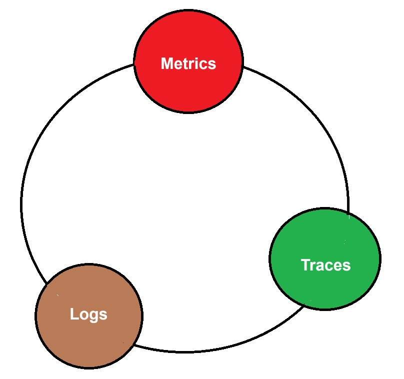
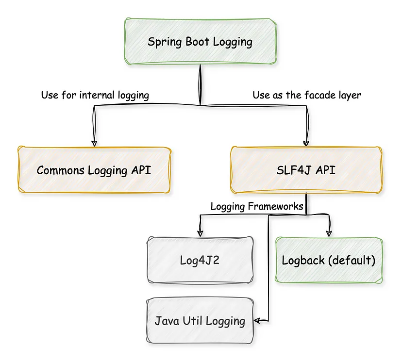

# OBSERVABILITY


## PILLARS OF OBSERVABILITY


<table style="border: none; width: 100%; ">
  <tr style="border: none">
    <td style="border: none"></td>
    <td style="border: none; vertical-align: top">
        <ul>
            <li><b>Metrics: </b> numeric measurements at a moment in time</li>
            <li><b>Logs: </b></li>
            <li><b>Traces:  </b></li>
        </ul>
    </td>
  </tr>
 </table>


## OBSERVABILITY IN SPRING FRAMEWORK
<table>
    <thead>
        <tr>
            <th>Telemetry</th>
            <th>Library</th>
            <th>Collector</th>
        </tr>
    </thead>
    <tbody>
        <tr>
            <td rowspan=6>Metrics Monitoring</td>
            <td rowspan=1>
                SpringBoot-2 + <b>Actuator</b> for Metrics + 
                <br/><b>Micrometer</b> for Custom Metrics +
                <br/><b>Prometheus</b> for Prometheus representation of actuator metrics
            <td rowspan=6>Prometheus:9090 / Otel Collector</td>
        </tr>
        <tr>
            <td rowspan=1><b>SpringBoot-3 + Actuator </b>(Micrometer included - which support Metrics & traces)</td>
        </tr>
        <tr>
            <td rowspan=1>SpringBoot + <b>Otel Java Agent</b> only for standard metrics</td>
        </tr>
        <tr>
            <td rowspan=1>SpringBoot + <b>Otel Java Agent</b> + <b>Micrometer</b> for custom Metrics</td>
        </tr>
        <tr>
            <td rowspan=1>SpringBoot + <b>Otel Starter Dependency</b></td>
        </tr>
        <tr>
            <td rowspan=1>SpringBoot + <b>Otel Starter Dependency + Micrometer </b> for custom Metrics</td>
        </tr>
        <tr>
            <td>Log Aggregation</td>
            <td> <b>SLF4J</b> : Logback / Log4J 2 </td>
            <td>
                Splunk:8000 / ELK:9200,5601 / Loki
            </td>
        </tr>
        <tr>
            <td rowspan=3>Distributed Trace</td>
            <td>
                <b>Spring 2</b> + Spring Cloud <b>Sleuth</b> + <b>Zipkin</b>
                <br/> <b>Sleuth:</b> Generate TraceId & SpanId to find execution Path Details & store in temp memory.
                <br/><b>Not required from Spring6, Spring use Micrometer</b>
                <br/><b>ZipkinClient:</b> It collects data from <b>Sleuth (Sampling) </b> and send to UI (Zipkin Server)
            </td>
            <td rowspan=3>Zipkin:9421 / Jaeger:16686 / Tempo:3200</td>
        </tr>
        <tr>
            <td>Spring Cloud Sleuth (Brave / OpenTelemetry)</td>
        </tr>
        <tr>
            <td>Otel Starter Dependency</td>
        </tr>
    </tbody>
</table>


````java
 public interface TeaService {
    void makeTea(String name);

    void teaLeaves();

    void waters();
}

public class DefaultTeaService implements TeaService {
    @Override
    void makeTea(String name) {
        //TODO...
    }

    @Override
    void teaLeaves() {
        //TODO...
    }
}

public class ObservedTeaService implements TeaService {
    private final DefaultTeaService delegate;
    private final ObservationRegistry observationRegistry;

    @Override
    public void makeTea(String name) {
        Observation.createNotStarted("make.tea", observationRegistry)
                .lowCardinalityKeyValue("name", "name")
                .lowCardinalityKeyValue("size", size)
                .observe(() -> delegate.makeTea());
    }
}
````


## [Logging](https://docs.spring.io/spring-boot/reference/features/logging.html)


Spring Boot uses [Commons Logging](https://commons.apache.org/logging) for all internal logging but leaves the underlying log implementation open. 

Default configurations are provided for [Java Util Logging](https://docs.oracle.com/en/java/javase/17/docs/api/java.logging/java/util/logging/package-summary.html), [Log4j2](https://logging.apache.org/log4j/2.x/), and [Logback](https://logback.qos.ch/)

By default, if you use the starters, Logback is used for logging

## [Log Format](https://docs.spring.io/spring-boot/reference/features/logging.html#features.logging.log-format)
The default log output from Spring Boot resembles the following example:
````
2024-09-19T09:38:56.347Z  INFO 111370 --- [myapp] [           main] o.s.b.w.embedded.tomcat.TomcatWebServer  : Tomcat initialized with port 8080 (http)
````
- Date and Time: Millisecond precision and easily sortable.
- Log Level: ERROR, WARN, INFO, DEBUG, or TRACE.
- Process ID.
- A --- separator to distinguish the start of actual log messages.
- Application name: Enclosed in square brackets (logged by default only if spring.application.name is set)
- Thread name: Enclosed in square brackets (may be truncated for console output).
- Correlation ID: If tracing is enabled (not shown in the sample above)
- Logger name: This is usually the source class name (often abbreviated).
- The log message.

> Note: If you have a spring.application.name property but don’t want it logged you can set logging.include-application-name to false.

## [File Output](https://docs.spring.io/spring-boot/reference/features/logging.html#features.logging.file-output)
````properties
# If both properties are set, logging.file.path is ignored and only logging.file.name is used.
logging.file.name=
logging.file.path=
````

## [File Rotation](https://docs.spring.io/spring-boot/reference/features/logging.html#features.logging.file-rotation)
If you are using the `Logback`, it is possible to fine-tune log rotation settings using your `application.properties` file.

For all other logging system, you will need to configure rotation settings directly yourself (for example, if you use Log4j2 then you could add a `log4j2.xml` or `log4j2-spring.xml` file).

|  Name | Description                                                            
|-------|------------------------------------------------------------------------|
| logging.logback.rollingpolicy.file-name-pattern    | The filename pattern used to create log archives.                                                                       |
| logging.logback.rollingpolicy.clean-history-on-start    | If log archive cleanup should occur when the application starts.                                                                       |
| logging.logback.rollingpolicy.max-file-size    | The maximum size of log file before it is archived.                    |
| logging.logback.rollingpolicy.total-size-cap    | The maximum amount of size log archives can take before being deleted. |
| logging.logback.rollingpolicy.max-history    | The maximum number of archive log files to keep (defaults to 7).       |


## [Log Levels](https://docs.spring.io/spring-boot/reference/features/logging.html#features.logging.log-levels)
All the supported logging systems can have the logger levels set in the Spring `Environment` (for example, in `application.properties`) by using `logging.level.<logger-name>=<level>` where `level` is one of TRACE, DEBUG, INFO, WARN, ERROR, FATAL, or OFF. The `root` logger can be configured by using `logging.level.root`.
````properties
-Dlogging.level.root=warn
-Dlogging.level.org.springframework.web=debug
logging.level.org.hibernate=error
````

or
````properties
mvn spring-boot:run 
  -Dspring-boot.run.arguments=--logging.level.org.springframework=TRACE,--logging.level.com.baeldung=TRACE
````

## log4j logging hierarchy order:

|       | Telemetry | Library | Collector | INFO | DEBUG | TRACE | ALL
|-------|-----------|---------|-----------|------|-------|-------|----
| OFF   |           |         |           |  |       |  |
| FATAL | X         |         |           |  |       |  |
| ERROR | X         | X       |           |  |       |  |
| WARN  | X         | X       | X         |  |       |  |
| INFO  | X         | X       | X         | X |       |  |
| DEBUG | X         | X       | X         | X | X     |  |
| TRACE | X         | X       | X         | X | X     | X |
| ALL   | X         | X       | X         | X | X     | X | X


## [Logback Extensions](https://docs.spring.io/spring-boot/reference/features/logging.html#features.logging.logback-extensions)
Spring Boot includes a number of extensions to Logback that can help with advanced configuration. You can use these extensions in your `logback-spring.xml` configuration file.
````xml
<springProfile name="staging">
	<!-- configuration to be enabled when the "staging" profile is active -->
</springProfile>

<springProfile name="dev | staging">
	<!-- configuration to be enabled when the "dev" or "staging" profiles are active -->
</springProfile>

<springProfile name="!production">
	<!-- configuration to be enabled when the "production" profile is not active -->
</springProfile>
````

Let’s write a simple logback-spring.xml:
````xml
<?xml version="1.0" encoding="UTF-8"?>
<configuration>

    <property name="LOGS" value="./logs" />

    <appender name="Console"
        class="ch.qos.logback.core.ConsoleAppender">
        <layout class="ch.qos.logback.classic.PatternLayout">
            <Pattern>
                %black(%d{ISO8601}) %highlight(%-5level) [%blue(%t)] %yellow(%C{1}): %msg%n%throwable
            </Pattern>
        </layout>
    </appender>

    <appender name="RollingFile"
        class="ch.qos.logback.core.rolling.RollingFileAppender">
        <file>${LOGS}/spring-boot-logger.log</file>
        <encoder
            class="ch.qos.logback.classic.encoder.PatternLayoutEncoder">
            <Pattern>%d %p %C{1} [%t] %m%n</Pattern>
        </encoder>

        <rollingPolicy
            class="ch.qos.logback.core.rolling.TimeBasedRollingPolicy">
            <!-- rollover daily and when the file reaches 10 MegaBytes -->
            <fileNamePattern>${LOGS}/archived/spring-boot-logger-%d{yyyy-MM-dd}.%i.log
            </fileNamePattern>
            <timeBasedFileNamingAndTriggeringPolicy
                class="ch.qos.logback.core.rolling.SizeAndTimeBasedFNATP">
                <maxFileSize>10MB</maxFileSize>
            </timeBasedFileNamingAndTriggeringPolicy>
        </rollingPolicy>
    </appender>
    
    <!-- LOG everything at INFO level -->
    <root level="info">
        <appender-ref ref="RollingFile" />
        <appender-ref ref="Console" />
    </root>

    <!-- LOG "com.baeldung*" at TRACE level -->
    <logger name="com.baeldung" level="trace" additivity="false">
        <appender-ref ref="RollingFile" />
        <appender-ref ref="Console" />
    </logger>

</configuration>

````

## Log4j2 Configuration Logging
````xml
<dependency>
    <groupId>org.springframework.boot</groupId>
    <artifactId>spring-boot-starter-web</artifactId>
    <exclusions>
        <exclusion>
            <groupId>org.springframework.boot</groupId>
            <artifactId>spring-boot-starter-logging</artifactId>
        </exclusion>
    </exclusions>
</dependency>

<dependency>
    <groupId>org.springframework.boot</groupId>
    <artifactId>spring-boot-starter-log4j2</artifactId>
</dependency>

````

## 7. Logging With Lombok
### 7.1. @Slf4j and @CommonsLog
````java
@RestController
@Slf4j
public class LombokLoggingController {
 
    @RequestMapping("/lombok")
    public String index() {
        log.trace("A TRACE Message");
        log.debug("A DEBUG Message");
        log.info("An INFO Message");
        log.warn("A WARN Message");
        log.error("An ERROR Message");
 
        return "Howdy! Check out the Logs to see the output...";
    }
}
````
### 7.2. @Log4j2
````java
@RestController
@Log4j2
public class LombokLoggingController {

    @RequestMapping("/lombok")
    public String index() {
        log.trace("A TRACE Message");
        log.debug("A DEBUG Message");
        log.info("An INFO Message");
        log.warn("A WARN Message");
        log.error("An ERROR Message");

        return "Howdy! Check out the Logs to see the output...";
    }
}

````

# FAQ:
1. What is default logging in SpringBoot? 
   - When using starters, Logback is used for logging by default.[logback](https://logback.qos.ch/)
2. 