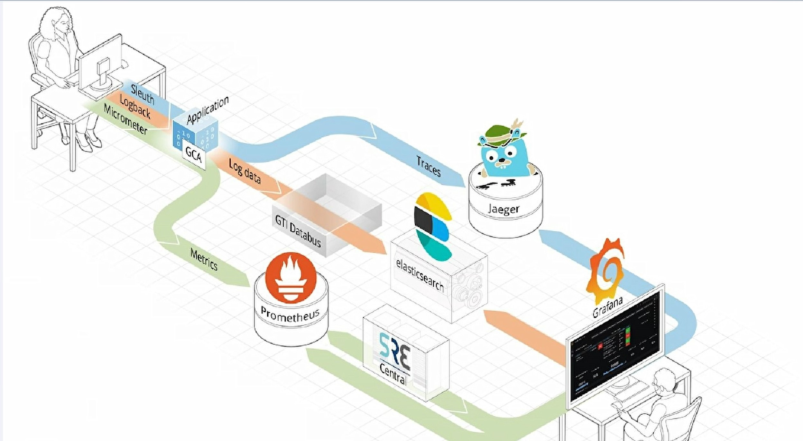
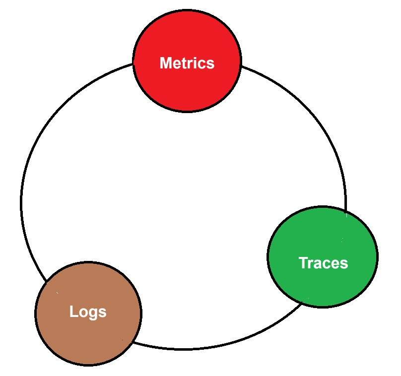

# OBSERVABILITY

### Read:
- [Actuator - JVM Metrics for SpringBoot](https://github.com/arpangroup/observability/tree/main/01-metrics-with-actuator)
- [Micrometer - Vendor Neutral Facade + Custom Metrics](https://github.com/arpangroup/observability/tree/main/02-metrics-with-micrometer)
  - Why Micrometer, although there is Actuator?
  - What is dimensionality? [What is "High Cardinality"?](https://github.com/arpangroup/observability/tree/main/02-metrics-with-micrometer#51-what-is-high-cardinality)
  - Should you use Java Agents to instrument your application?
- ddfds

## PILLARS OF OBSERVABILITY

<table style="border: none; width: 100%; ">
  <tr style="border: none">
    <td style="border: none"></td>
    <td style="border: none; vertical-align: top">
        <ul>
            <li><b>Metrics: </b> numeric measurements at a moment in time</li>
            <li><b>Logs: </b> Provides insight into application-specific messages emitted by processes</li>
            <li><b>Traces:  </b>or more precisely "distributed-traces" - are samples of casual chain of events (or transactions) between different component in a microservice system </li>
        </ul>
    </td>
  </tr>
 </table>

## OBSERVABILITY IN SPRING FRAMEWORK
<table>
    <thead>
        <tr>
            <th>Telemetry</th>
            <th>Library</th>
            <th>Collector</th>
        </tr>
    </thead>
    <tbody>
        <tr>
            <td rowspan=6>Metrics Monitoring</td>
            <td rowspan=1>
                SpringBoot-2 + <b>Actuator</b> for Metrics + 
                 <b>Micrometer</b> for Custom Metrics +
                 <b>Prometheus</b> for Prometheus representation of actuator metrics
            <td rowspan=6>Prometheus:9090 / Otel Collector</td>
        </tr>
        <tr>
            <td rowspan=1><b>SpringBoot-3 + Actuator </b>(Micrometer included - which support Metrics & traces)</td>
        </tr>
        <tr>
            <td rowspan=1>SpringBoot + <b>Otel Java Agent</b> only for standard metrics</td>
        </tr>
        <tr>
            <td rowspan=1>SpringBoot + <b>Otel Java Agent</b> + <b>Micrometer</b> for custom Metrics</td>
        </tr>
        <tr>
            <td rowspan=1>SpringBoot + <b>Otel Starter Dependency</b></td>
        </tr>
        <tr>
            <td rowspan=1>SpringBoot + <b>Otel Starter Dependency + Micrometer </b> for custom Metrics</td>
        </tr>
        <tr>
            <td>Log Aggregation</td>
            <td> <b>SLF4J</b> : Logback / Log4J 2 </td>
            <td>
                Splunk:8000 / ELK:9200,5601 / Loki
            </td>
        </tr>
        <tr>
            <td rowspan=3>Distributed Trace</td>
            <td>
                <b>Spring 2</b> + Spring Cloud <b>Sleuth</b> + <b>Zipkin</b>
                  <b>Sleuth:</b> Generate TraceId & SpanId to find execution Path Details & store in temp memory.
                 <b>Not required from Spring6, Spring use Micrometer</b>
                 <b>ZipkinClient:</b> It collects data from <b>Sleuth (Sampling) </b> and send to UI (Zipkin Server)
            </td>
            <td rowspan=3>Zipkin:9421 / Jaeger:16686 / Tempo:3200</td>
        </tr>
        <tr>
            <td>Spring Cloud Sleuth (Brave / OpenTelemetry)</td>
        </tr>
        <tr>
            <td>Otel Starter Dependency</td>
        </tr>
    </tbody>
</table>

## GETTING STARTED
- To get start with **metrics**, visit [here]()
  - Without Java Agent - SpringBoot2 + Actuator + Micrometer
  - Without Java Agent - SpringBoot3 + Actuator
  - With Java Agent - OpenTelemetry Java Agent
  - Without Otel Java Agent, but using Spring otel dependency
  - Collect Metrics using Prometheus
  - Collect Metrics using OtelCollector
- To get start with **logs**, visit [here](https://github.com/arpangroup/observability/tree/otel-collector-with-log/00-logging)
  - SpringBoot Basic Logging concepts like: [LogFormat](https://github.com/arpangroup/observability/tree/otel-collector-with-log/00-logging#log-format), [log levels](https://github.com/arpangroup/observability/blob/otel-collector-with-log/00-logging/README-log-level.md), [File output](https://github.com/arpangroup/observability/tree/otel-collector-with-log/00-logging#file-output), [File Rotation](https://github.com/arpangroup/observability/tree/otel-collector-with-log/00-logging#file-rotation) etc...
  - [Log4J vs Log4J2 vs Logback](https://github.com/arpangroup/observability/tree/otel-collector-with-log/00-logging#log4j-vs-log4j2-vs-logback)
  - [Why Logback is default in Spring Boot?](https://stackoverflow.com/questions/55684592/why-is-logback-the-default-logging-framework-in-spring-boot)
  - How to write logs in different files for error and (info debug) in another in Spring?
  - Logging using **Logback**
    - Various Logback Appenders like `ConsoleAppender`, `FileAppender`, `TCP Appender` etc...
    - Create Custom Logback Appender
    - Access of Spring ApplicationContext in Logback Appender
  - Logging Using **Log4J2**
  - Hide/Mask sensitive data in log 
  - Log MDC
  - Collect Log Using ELK
  - Collect Log Using Splunk
  - Collect Log Using OtelCollector
- To get start with **traces**, visit [here]()
  - Basic of Trace
  - Traces using Zipkin & Sleuth
  - Traces using Jaeger
  - Traces using Grafana Tempo 

## EXAMPLES
 - Logging using **Logback**
 - Logging Using **Log4J2**

## References
- https://linkedin.github.io/school-of-sre/level101/metrics_and_monitoring/observability/
- https://github.com/prometheus/OpenMetrics/blob/main/specification/OpenMetrics.md

